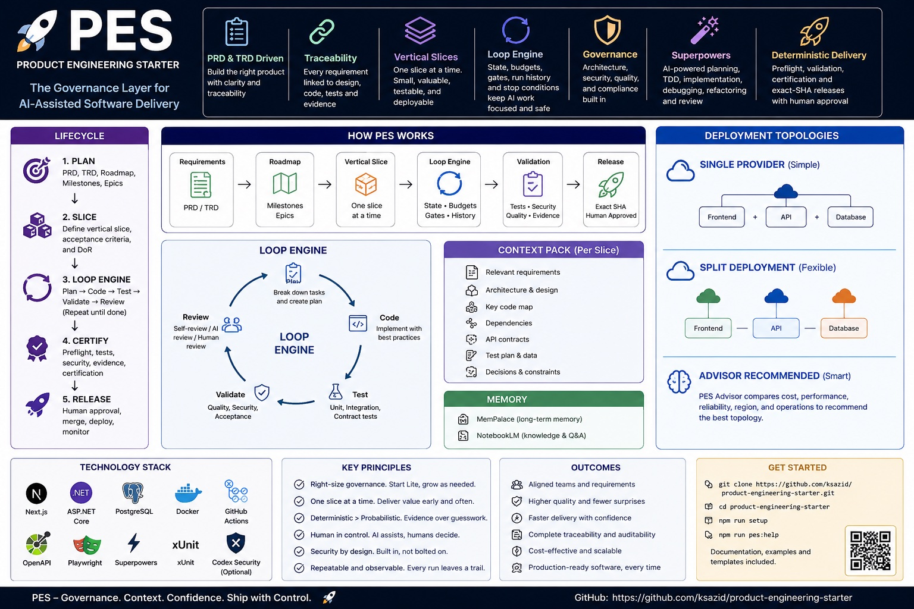

<p align="center">
  
</p>

# Kairo

Kairo is the customer-facing product name for the approved **Content Intelligence Engine (CIE)** venture.

This repository was created from the Product Engineering Starter (PES) template. PES remains the governance and delivery framework; Kairo's approved product definition lives under `product/`.

## Approved product authority

- `product/PRD.md` — CIE-PRD-001 v1.0
- `product/TRD.md` — CIE-TRD-001 v1.0
- `product/DESIGN.md` — CIE-DESIGN-001 v1.0
- `product/GLOSSARY.md` — CIE-GLOSSARY-001 v1.0
- `product/VENTURE-PACKAGE.yaml` — frozen Kairo venture package approved for PES
- `evaluation/SKILLS-ARCHITECTURE.md` — approved dynamic Skills architecture input
- `decisions/DECISIONS.md` — authoritative Innovation Hub decision record copied for traceability

## Delivery authority

PES controls intake, traceability, planning, vertical slices, approvals, Loop lifecycle, deterministic checks, certification and human merge/release authority.

Superpowers is the default implementation methodology **inside** the PES loop after a slice is approved and activated.

The authoritative live delivery state is recorded in:

- `delivery/current-slice.json` — current governed slice/lifecycle state;
- `delivery/completed-slices.json` — certified historical slices;
- `.engineering/STATE.json` — next permitted engineering action;
- `delivery/decisions.json` — machine-readable approved decisions;
- `delivery/backlog.json` — governed future-slice backlog when populated.

README is a human-readable feature ledger, not a replacement for those authority files.

## Kairo implementation profile

Kairo uses the approved **PES Web/AI profile** direction:

- Next.js + React + TypeScript for web;
- Node.js + TypeScript modular-monolith API/workers;
- Python only for approved runtime components such as Hermes integration;
- PostgreSQL as authoritative system of record;
- provider-neutral AI boundaries;
- Brand-aware sector/source policy;
- governed Skill Registry / Marketing Lab boundaries;
- deterministic Truth/Claims and publishing controls.

## Current state

Runtime delivery is certified and merged through **VS-18 Creative Asset Production**. **VS-19 Marketing Lab Shadow Execution** is the active governed slice while its exact certification candidate is prepared. Release, deployment and production enablement remain separate human approvals.

## Feature ledger

Status terms:

- **Implemented / governed** — runtime capability exists and was delivered through governed slices.
- **Partial** — useful runtime foundation exists, but important production/channel capability remains incomplete.
- **Shadow / evaluation** — executable only inside the bounded Marketing Lab evaluation path; not production Brand execution.
- **Architecture / evaluation** — approved direction or candidate only; not an installed production dependency.

| Capability | Status | Current Kairo implementation |
|---|---|---|
| Account / Workspace / Brand | Implemented / governed | Tenant and Brand identity, membership and Brand scope foundation. |
| Brand Brain / Knowledge | Implemented / governed | Brand-private context, knowledge sources, provenance and safe deletion/ingestion controls. |
| Hunter / Discover | Implemented / governed | Public discovery, Signals, Opportunities, Brand relevance and evidence lineage. |
| Sector-aware Hunter | Implemented / governed | Brand intelligence profiles, sector packs, source registry/policy resolution and query planning. |
| Free public discovery | Implemented / governed | RSS/Atom, Hacker News, Bluesky public AppView and YouTube Data API adapters behind the generic Hunter. |
| Research / Claim Ledger | Implemented / governed | Research dossiers, sources, uncertainty, structured Claims and evidence-backed downstream context. |
| Strategist / Angles | Implemented / governed | Candidate Angles with audience, objective, hook direction, format/channel guidance and Claim lineage. |
| Campaign / Content Studio | Implemented / governed | Campaign lineage, Content Assets, immutable Content Versions and generation/editing flows. |
| Drafter | Implemented / governed | Bounded Brand-scoped drafting/revision using supplied Claims; no publishing authority. |
| Critic / Judge / Truth Gate | Implemented / governed | Independent review, deterministic truth/policy enforcement, bounded revision and exact-version human approval. |
| Calendar / Publishing | Implemented / governed | Deterministic jobs, idempotency/retries/reconciliation and official channel-adapter boundary. |
| Instagram account connection | Implemented / governed | Server-side Meta OAuth flow, encrypted channel credentials, scoped account selection, reconnect/expiry handling. |
| Instagram publishing | Partial | Official Instagram Professional single-image + caption publishing exists; Reel/carousel publishing remains future work. |
| Instagram Insights | Implemented / governed foundation | Scoped Insights collection, metric jobs, unavailable/retry states and provenance-backed ingestion. |
| LinkedIn publishing | Implemented / governed foundation | Official organization publishing adapter boundary and governed scheduling/publishing flow. |
| Performance tracking | Implemented / governed | Raw/normalised metric model, provenance, asynchronous collection boundary and Brand baselines. |
| Performance learning | Implemented / governed | Evidence-scoped Candidate Learnings with cautious correlation and bounded next-experiment proposals. |
| Pilot operations / safety / cost | Implemented / governed | Operational states, retries, intervention/safety controls and bounded runtime/cost behavior. |
| Carousel asset production | Implemented / governed | Deterministic Claim-linked PNG slides with stable renderer/source fingerprints and private Brand-scoped object keys. |
| Reel production package | Partial | Deterministic storyboard PNGs plus timed canonical render manifest; final MP4 encoder/provider is intentionally deferred. |
| Dynamic Skill Registry / benchmark foundation | Implemented / governed evaluation foundation | Versioned manifests, permissions, benchmark stages and Brand-qualification rules exist; external production activation remains disabled unless separately qualified and selected. |
| Corey Haines `marketingskills` | Shadow / evaluation | Exact upstream pins are verified; the `social` capability is registered only as a sandboxed shadow challenger with no network, secrets or publishing authority. |
| Marketing Lab shadow execution | Active governed slice | VS-19 executes verified external reference content through Kairo's zero-tool AgentRuntime boundary on synthetic/public-safe fixtures and produces paired benchmark evidence only. |
| Paperclip control plane | Architecture / evaluation | Candidate only; native PES/Loop/runtime control remains authoritative and Paperclip is not a runtime dependency. |

## Current content intelligence loop

```text
Brand Brain
  + Sector / Audience / Geography
        ↓
Sector-aware Hunter
        ↓
RSS / HN / Bluesky / YouTube / approved discovery providers
        ↓
Signals → Opportunities
        ↓
Research → Claims
        ↓
Strategist → candidate Angles
        ↓
Campaign / Content Studio
        ↓
Drafter
        ↓
Truth Gate → Critic → Judge
        ↓
Human approval
        ↓
Creative asset production / deterministic channel adapter
        ↓
Published Post
        ↓
Performance metrics
        ↓
Candidate Learning
```

Marketing Lab is a **sidecar evaluation path**, not a shortcut around this loop:

```text
Pinned external candidate
  → provenance + permission verification
  → synthetic/public-safe shadow execution
  → same-input Kairo Native comparison
  → Truth / quality / human / cost / latency gates
  → at most advance-to-live eligibility
```

A shadow result does not create Brand selection, publishing authority or production execution.

## External-skill adoption rule

Do **not** copy or install an external skill repository wholesale into Kairo.

For each candidate capability:

```text
External candidate
  → licence / provenance / security review
  → pin exact revision + Git blob identity
  → declare permissions / network / secret requirements
  → offline benchmark against Kairo Native
  → sandboxed shadow benchmark
  → separately approved live benchmark if justified
  → human qualification decision
  → Brand-scoped selection / controlled rollout
  → performance + safety monitoring
```

Kairo-owned non-replaceable controls remain authoritative: Workspace/Brand isolation, Truth/Claims policy, publishing authorization, secret handling, cost budgets, metric provenance, Brand Learning policy and skill approval/benchmarking.

## Future / deferred improvements

The following are **not current production claims** and require separately governed work:

- OpenAlex and Crossref research/evidence adapters.
- Instagram Reel and carousel publishing.
- Final provider-neutral MP4 Reel encoder/render worker.
- Multilingual creative rendering/font support; the current deterministic bitmap renderer fails closed outside its supported glyph set.
- Live Marketing Lab evaluation only after a shadow challenger earns `advance-to-live` and receives separate governed approval.
- External Brand-skill selection/production activation only after sufficient live evidence and explicit qualification.
- Paperclip control-plane spike only if native orchestration becomes insufficient and evaluation justifies the operational overhead.

## PES workflow

```text
Approved venture package
→ product / technical / security intake
→ source-linked requirements
→ roadmap / milestones / epics / vertical slices
→ typed approvals
→ activate one slice
→ Superpowers planning / TDD / implementation / review
→ deterministic preflight
→ certification
→ human merge / release approval
```

See `AGENTS.md` and `docs/governance/END-TO-END.md` for the authoritative repository workflow.
